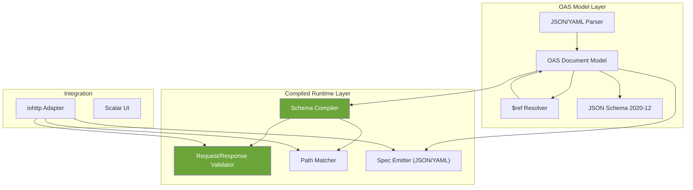

<p align="center">
  <strong>liboas</strong> — <em>lib</em>rary for <em>O</em>pen<em>A</em>PI <em>S</em>pecification<br>
  OpenAPI 3.2 library for C23
</p>

<p align="center">
  <a href="https://www.gnu.org/licenses/gpl-3.0.html"></a>
  <a href="https://www.open-std.org/jtc1/sc22/wg14/www/docs/n3220.pdf"></a>
  <a href="https://kernel.org"></a>
  <a href="https://spec.openapis.org/oas/v3.2.0.html"></a>
  <a href="https://github.com/ibireme/yyjson"></a>
</p>

---

liboas is a C23 library for parsing, validating, and serving OpenAPI 3.2 specifications. Two-layer architecture: **OAS Model** (parse and represent OpenAPI documents) and **Compiled Runtime** (pre-compiled validator and router for high-performance request/response validation).

Designed for integration with [iohttp](https://github.com/dantte-lp/iohttp) via adapter pattern, but usable standalone.

## Quick Start

```bash
git clone https://github.com/dantte-lp/liboas.git && cd liboas
cmake --preset clang-debug
cmake --build --preset clang-debug
ctest --preset clang-debug
```

## Architecture



## Key Features

- Full OpenAPI 3.2 document model (paths, operations, schemas, components)
- JSON Schema 2020-12 validation (type, format, pattern, min/max, allOf/oneOf/anyOf)
- Pre-compiled schema validators for zero-allocation hot path
- `$ref` resolution (local, remote, recursive with cycle detection)
- Path template matching with parameter extraction
- Request/response validation middleware
- JSON and YAML spec emission
- iohttp adapter for automatic route validation
- Scalar UI integration for API documentation

## Documentation

Full documentation is available in [`docs/`](docs/README.md):

| # | Document | Description |
|---|---|---|
| 01 | [Architecture](docs/en/01-architecture.md) | System architecture, two-layer design |
| 02 | [OAS Model](docs/en/02-oas-model.md) | OpenAPI document model, parsing |
| 03 | [JSON Schema](docs/en/03-json-schema.md) | JSON Schema 2020-12 validation |
| 04 | [Schema Compiler](docs/en/04-schema-compiler.md) | Pre-compilation, optimization |
| 05 | [Validator](docs/en/05-validator.md) | Request/response validation |
| 06 | [Integration](docs/en/06-integration.md) | iohttp adapter, middleware |
| 07 | [API Reference](docs/en/07-api-reference.md) | Public API documentation |
| 08 | [Development](docs/en/08-development.md) | Dev workflow, testing, quality |

## Contributing

See [docs/en/08-development.md](docs/en/08-development.md) for development workflow, coding standards, and testing requirements.

## License

GPLv3 - see [LICENSE](LICENSE) for details.
