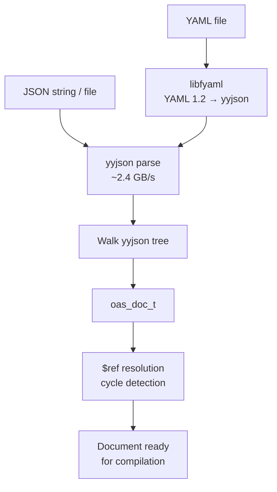

# OAS Document Model

The document model represents a parsed OpenAPI 3.2 specification as a tree of C
structs, all arena-allocated. Header: `oas_doc.h`.

## Core Types

### oas_doc_t

Top-level document. Fields:

| Field            | Type                      | Description                        |
|------------------|---------------------------|------------------------------------|
| `openapi`        | `const char *`            | Version string, e.g. `"3.2.0"`    |
| `info`           | `oas_info_t *`            | API metadata (title, version)      |
| `servers`        | `oas_server_t **`         | Array of server definitions        |
| `paths`          | `oas_path_entry_t *`      | Array of path-to-path_item pairs   |
| `components`     | `oas_components_t *`      | Reusable schemas, security schemes |
| `security`       | `oas_security_req_t **`   | Global security requirements       |
| `tags`           | `oas_tag_t **`            | Tag definitions                    |

### oas_info_t

API metadata: `title`, `summary`, `description`, `version`, `terms_of_service`,
plus optional `oas_contact_t` and `oas_license_t`.

### oas_server_t

Server URL with optional `description` and server variables
(`oas_server_var_t`). Variables define `default_value`, `description`, and
optional `enum_values`.

### oas_path_item_t

Represents a single API path. Contains per-method operation pointers (`get`,
`post`, `put`, `delete_`, `patch`, `head`, `options`) and shared path-level
parameters.

### oas_operation_t

An HTTP operation with:

- `operation_id` -- unique identifier
- `summary`, `description`, `tags`
- `parameters` -- array of `oas_parameter_t *`
- `request_body` -- optional `oas_request_body_t *`
- `responses` -- array of `oas_response_entry_t` (status code to response)
- `security` -- operation-level security overrides

### oas_parameter_t

Describes a single parameter:

- `name` -- parameter name
- `in` -- location: `"query"`, `"header"`, `"path"`, `"cookie"`
- `required` -- whether the parameter is mandatory
- `schema` -- the parameter's JSON Schema

### oas_request_body_t

Request body with `description`, `required` flag, and an array of
`oas_media_type_entry_t` content entries. Each entry maps a media type string
(e.g. `"application/json"`) to an `oas_media_type_t` containing a schema.

### oas_response_t / oas_response_entry_t

Responses are keyed by status code string (`"200"`, `"404"`, `"default"`).
Each `oas_response_t` has a `description` and content media type entries.

### oas_components_t

Reusable component definitions:

- `schemas` -- named JSON Schema definitions
- `security_schemes` -- authentication schemes
- `responses`, `parameters`, `request_bodies`, `headers` -- reusable objects

### oas_security_scheme_t

Security scheme types: `"apiKey"`, `"http"`, `"oauth2"`, `"openIdConnect"`.
Includes scheme-specific fields (`name`, `in`, `scheme`, `bearer_format`,
`open_id_connect_url`) and OAuth2 flows via `oas_oauth_flows_t`.

## Parsing Pipeline



### From JSON String

```c
oas_arena_t *arena = oas_arena_create(0);
oas_error_list_t *errors = oas_error_list_create(arena);

oas_doc_t *doc = oas_doc_parse(arena, json_str, json_len, errors);
if (!doc) {
    /* check errors for details */
}
```

The parser uses yyjson (~2.4 GB/s) to parse the JSON, then walks the yyjson
tree to populate `oas_doc_t` and all nested types. String fields point directly
into the yyjson buffer (zero-copy).

### From File

```c
oas_doc_t *doc = oas_doc_parse_file(arena, "/path/to/openapi.json", errors);
```

Reads the file into memory, then delegates to `oas_doc_parse`.

### YAML Support

YAML parsing requires libfyaml (optional, enabled via CMake option). libfyaml
is used instead of libyaml because OpenAPI 3.x requires YAML 1.2 semantics,
which libyaml (YAML 1.1 only) does not support.

When enabled, the parser detects YAML input and converts it to a yyjson
document before proceeding with the same model construction path.

## $ref Resolution

After parsing, `$ref` pointers in the document tree are symbolic strings
(e.g. `"#/components/schemas/Pet"`). The resolver walks the document and
replaces each `$ref` with a pointer to the target node.

Key properties:

- **Cycle detection**: tracks visited nodes to detect circular references.
- **Chain following**: resolves chains of `$ref -> $ref -> target`.
- **JSON Pointer**: uses RFC 6901 JSON Pointer parsing for fragment resolution.
- **Error reporting**: unresolvable refs are added to the error list.

After resolution, `oas_schema_t.ref_resolved` points to the target schema
while `oas_schema_t.ref` retains the original `$ref` string.

## Memory Ownership

All model structs are arena-allocated. The lifecycle is:

1. Create arena with `oas_arena_create(block_size)`.
2. Parse or build the document.
3. Use the document (validate, emit, etc.).
4. Call `oas_doc_free(doc)` to release the yyjson document (frees string buffer).
5. Call `oas_arena_destroy(arena)` to free all model nodes.

Calling `oas_doc_free()` invalidates all `const char *` string pointers in the
model that reference the original JSON. Only call it after you no longer need
those strings.

## Code-First Construction

Documents can be built programmatically using the builder API (`oas_builder.h`)
instead of parsing from JSON. See the [Integration Guide](06-integration.md)
for the code-first workflow.
