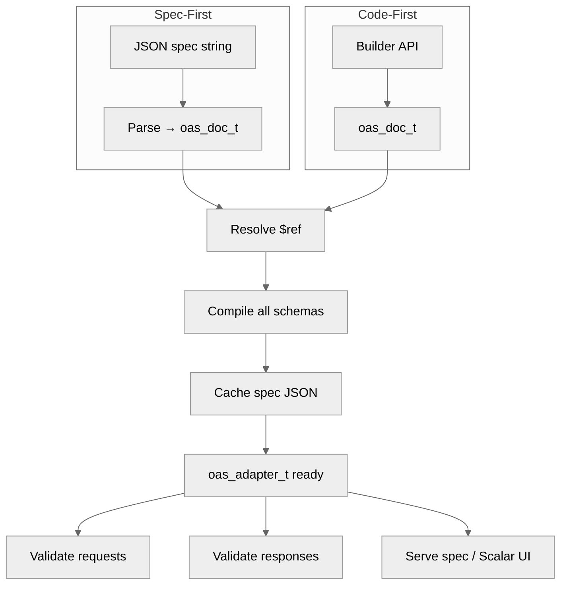

# Integration Guide

The adapter API (`oas_adapter.h`) provides a unified facade for integrating
liboas with HTTP servers. It wraps the parser, compiler, validator, and emitter
into a single lifecycle.

## Spec-First Workflow

Load an OpenAPI specification from JSON, compile it, and validate requests:

```c
#include <liboas/oas_adapter.h>

/* Configure the adapter */
oas_adapter_config_t config = {
    .validate_requests  = true,
    .validate_responses = false,  /* enable in development */
    .serve_spec         = true,
    .serve_scalar       = true,
    .spec_url           = "/openapi.json",
    .docs_url           = "/docs",
};

/* Create adapter from JSON spec */
oas_error_list_t *errors = oas_error_list_create(arena);
oas_adapter_t *adapter = oas_adapter_create(spec_json, spec_len, &config, errors);
if (!adapter) {
    /* handle parse/compile errors */
}

/* Use adapter for request validation, spec serving, etc. */

/* Cleanup */
oas_adapter_destroy(adapter);
```

The adapter internally:



1. Creates an arena and parses the JSON into `oas_doc_t`.
2. Resolves all `$ref` references.
3. Compiles all schemas with the default regex backend.
4. Caches the spec JSON for serving.

## Code-First Workflow

Build an OpenAPI document programmatically using the builder API, then create
an adapter from it:

```c
#include <liboas/oas_adapter.h>
#include <liboas/oas_builder.h>

oas_arena_t *arena = oas_arena_create(0);

/* Build the document */
oas_doc_t *doc = oas_doc_build(arena, "Pet Store", "1.0.0");
oas_doc_add_server(doc, arena, "https://api.example.com", "Production");

/* Define schemas */
oas_schema_t *pet = oas_schema_build_object(arena);
oas_schema_add_property(arena, pet, "id", oas_schema_build_int64(arena));
oas_schema_add_property(arena, pet, "name", oas_schema_build_string(arena));
oas_schema_set_required(arena, pet, "id", "name", NULL);
oas_doc_add_component_schema(doc, arena, "Pet", pet);

/* Define operations */
oas_response_builder_t responses[] = {
    {.status = 200, .description = "Pet list", .schema = oas_schema_build_array(arena, pet)},
    {.status = 0},  /* sentinel */
};

oas_op_builder_t op = {
    .summary      = "List all pets",
    .operation_id = "listPets",
    .tag          = "pets",
    .responses    = responses,
};

oas_doc_add_path_op(doc, arena, "/pets", "GET", &op);

/* Create adapter from builder-constructed document */
oas_adapter_t *adapter = oas_adapter_from_doc(doc, arena, &config, errors);
```

## Configuration

`oas_adapter_config_t` controls adapter behavior:

| Field                | Type          | Default             | Description                    |
|----------------------|---------------|---------------------|--------------------------------|
| `validate_requests`  | `bool`        | `false`             | Validate incoming requests     |
| `validate_responses` | `bool`        | `false`             | Validate outgoing responses    |
| `serve_spec`         | `bool`        | `false`             | Serve spec JSON at `spec_url`  |
| `serve_scalar`       | `bool`        | `false`             | Serve Scalar UI at `docs_url`  |
| `spec_url`           | `const char*` | `"/openapi.json"`   | URL path for spec serving      |
| `docs_url`           | `const char*` | `"/docs"`           | URL path for Scalar UI         |

Pass `nullptr` for config to use all defaults (no validation, no serving).

## Spec Serving

When `serve_spec` is enabled, the adapter caches the JSON representation:

```c
size_t json_len;
const char *json = oas_adapter_spec_json(adapter, &json_len);
/* respond with Content-Type: application/json */
```

The returned string is owned by the adapter and valid for its lifetime.

## Scalar UI

Generate an HTML page for the Scalar API documentation viewer:

```c
size_t html_len;
char *html = oas_scalar_html("Pet Store API", "/openapi.json", &html_len);
/* respond with Content-Type: text/html */
free(html);  /* caller owns the string */
```

The generated HTML loads the Scalar UI from CDN and points it at the spec URL.

## Operation Lookup

Find the operation matching a request method and path:

```c
oas_matched_operation_t match;
int rc = oas_adapter_find_operation(adapter, "GET", "/pets/123", &match, arena);
if (rc == 0) {
    printf("Matched: %s %s\n", match.method, match.path_template);
    printf("Operation ID: %s\n", match.operation_id);
    for (size_t i = 0; i < match.param_count; i++) {
        printf("  %s = %s\n", match.param_names[i], match.param_values[i]);
    }
} else if (rc == -ENOENT) {
    /* no matching operation */
}
```

The `oas_matched_operation_t` contains:

- `operation_id` -- the `operationId` if defined (nullable)
- `path_template` -- matched template (e.g. `"/pets/{petId}"`)
- `method` -- HTTP method
- `param_names` / `param_values` / `param_count` -- extracted path parameters

## Request Validation via Adapter

```c
oas_http_request_t req = {
    .method       = "POST",
    .path         = "/pets",
    .content_type = "application/json",
    .body         = body,
    .body_len     = body_len,
};

oas_validation_result_t result = {0};
oas_arena_t *req_arena = oas_arena_create(0);
int rc = oas_adapter_validate_request(adapter, &req, &result, req_arena);

if (!result.valid) {
    char *problem = oas_problem_from_validation(&result, 422, nullptr);
    /* send 422 response with problem JSON */
    oas_problem_free(problem);
}
oas_arena_destroy(req_arena);
```

Use a per-request arena for validation error allocations. This keeps the
adapter's arena clean and allows O(1) cleanup after each request.

## Response Validation via Adapter

```c
oas_http_response_t resp = {
    .status_code  = 200,
    .content_type = "application/json",
    .body         = response_body,
    .body_len     = response_body_len,
};

oas_validation_result_t result = {0};
int rc = oas_adapter_validate_response(adapter, "/pets", "GET", &resp, &result, arena);
```

Response validation is typically enabled only in development/testing to catch
response schema drift.

## Middleware Pattern

A typical HTTP middleware integration:

```c
int handle_request(http_request *raw_req, http_response *raw_resp) {
    /* Build oas_http_request_t from your framework's request type */
    oas_http_request_t req = convert_request(raw_req);

    /* Check for spec/docs serving */
    const oas_adapter_config_t *cfg = oas_adapter_config(adapter);
    if (cfg->serve_spec && strcmp(req.path, cfg->spec_url) == 0) {
        size_t len;
        const char *json = oas_adapter_spec_json(adapter, &len);
        return send_response(raw_resp, 200, "application/json", json, len);
    }

    /* Validate request */
    if (cfg->validate_requests) {
        oas_arena_t *req_arena = oas_arena_create(0);
        oas_validation_result_t result = {0};
        oas_adapter_validate_request(adapter, &req, &result, req_arena);
        if (!result.valid) {
            char *problem = oas_problem_from_validation(&result, 422, nullptr);
            int rc = send_response(raw_resp, 422, "application/problem+json",
                                   problem, strlen(problem));
            oas_problem_free(problem);
            oas_arena_destroy(req_arena);
            return rc;
        }
        oas_arena_destroy(req_arena);
    }

    /* Dispatch to handler ... */
    return dispatch(raw_req, raw_resp);
}
```

## Accessing the Document

Retrieve the parsed document from the adapter for inspection:

```c
const oas_doc_t *doc = oas_adapter_doc(adapter);
printf("API: %s v%s\n", doc->info->title, doc->info->version);
```

## Content Negotiation

The `oas_negotiate.h` header provides content type negotiation:

```c
const char *available[] = {"application/json", "application/xml"};
const char *best = oas_negotiate_content_type(accept_header, available, 2);
```

Returns the best matching media type from the `Accept` header, or `nullptr`
if no acceptable type is available.
