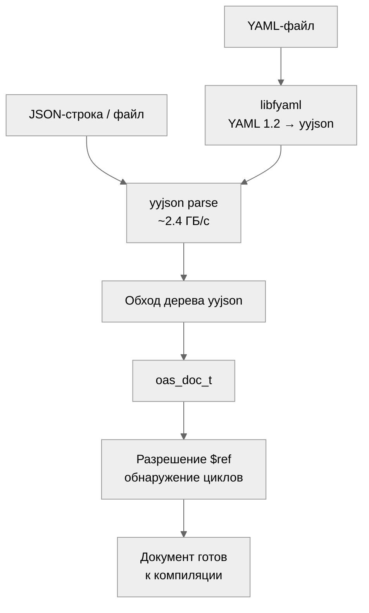

# Модель документа OAS

Модель документа представляет разобранную спецификацию OpenAPI 3.2 в виде дерева
C-структур, аллоцированных через арену. Заголовок: `oas_doc.h`.

## Основные типы

### oas_doc_t

Документ верхнего уровня. Поля:

| Поле             | Тип                       | Описание                           |
|------------------|---------------------------|------------------------------------|
| `openapi`        | `const char *`            | Строка версии, напр. `"3.2.0"`    |
| `info`           | `oas_info_t *`            | Метаданные API (title, version)    |
| `servers`        | `oas_server_t **`         | Массив определений серверов        |
| `paths`          | `oas_path_entry_t *`      | Массив пар путь-path_item          |
| `components`     | `oas_components_t *`      | Переиспользуемые схемы, схемы безопасности |
| `security`       | `oas_security_req_t **`   | Глобальные требования безопасности |
| `tags`           | `oas_tag_t **`            | Определения тегов                  |

### oas_info_t

Метаданные API: `title`, `summary`, `description`, `version`, `terms_of_service`,
а также опциональные `oas_contact_t` и `oas_license_t`.

### oas_server_t

URL сервера с опциональным `description` и серверными переменными
(`oas_server_var_t`). Переменные определяют `default_value`, `description` и
опциональные `enum_values`.

### oas_path_item_t

Представляет один путь API. Содержит указатели на операции по методам (`get`,
`post`, `put`, `delete_`, `patch`, `head`, `options`) и общие параметры
уровня пути.

### oas_operation_t

HTTP-операция с:

- `operation_id` -- уникальный идентификатор
- `summary`, `description`, `tags`
- `parameters` -- массив `oas_parameter_t *`
- `request_body` -- опциональный `oas_request_body_t *`
- `responses` -- массив `oas_response_entry_t` (код статуса -> ответ)
- `security` -- переопределения безопасности на уровне операции

### oas_parameter_t

Описывает отдельный параметр:

- `name` -- имя параметра
- `in` -- расположение: `"query"`, `"header"`, `"path"`, `"cookie"`
- `required` -- является ли параметр обязательным
- `schema` -- JSON Schema параметра

### oas_request_body_t

Тело запроса с `description`, флагом `required` и массивом записей контента
`oas_media_type_entry_t`. Каждая запись сопоставляет строку медиатипа
(напр. `"application/json"`) с `oas_media_type_t`, содержащим схему.

### oas_response_t / oas_response_entry_t

Ответы индексируются строкой кода статуса (`"200"`, `"404"`, `"default"`).
Каждый `oas_response_t` имеет `description` и записи медиатипов контента.

### oas_components_t

Определения переиспользуемых компонентов:

- `schemas` -- именованные определения JSON Schema
- `security_schemes` -- схемы аутентификации
- `responses`, `parameters`, `request_bodies`, `headers` -- переиспользуемые объекты

### oas_security_scheme_t

Типы схем безопасности: `"apiKey"`, `"http"`, `"oauth2"`, `"openIdConnect"`.
Включает специфичные для схемы поля (`name`, `in`, `scheme`, `bearer_format`,
`open_id_connect_url`) и потоки OAuth2 через `oas_oauth_flows_t`.

## Конвейер парсинга



### Из JSON-строки

```c
oas_arena_t *arena = oas_arena_create(0);
oas_error_list_t *errors = oas_error_list_create(arena);

oas_doc_t *doc = oas_doc_parse(arena, json_str, json_len, errors);
if (!doc) {
    /* check errors for details */
}
```

Парсер использует yyjson (~2.4 ГБ/с) для разбора JSON, затем обходит дерево
yyjson для заполнения `oas_doc_t` и всех вложенных типов. Строковые поля
указывают непосредственно в буфер yyjson (zero-copy).

### Из файла

```c
oas_doc_t *doc = oas_doc_parse_file(arena, "/path/to/openapi.json", errors);
```

Считывает файл в память, затем делегирует выполнение `oas_doc_parse`.

### Поддержка YAML

Парсинг YAML требует libfyaml (опционально, включается через опцию CMake).
Используется libfyaml вместо libyaml, поскольку OpenAPI 3.x требует семантику
YAML 1.2, которую libyaml (только YAML 1.1) не поддерживает.

При включении парсер определяет YAML-ввод и преобразует его в документ yyjson,
после чего выполняется тот же путь построения модели.

## Разрешение $ref

После парсинга указатели `$ref` в дереве документа представляют собой символьные
строки (напр. `"#/components/schemas/Pet"`). Резолвер обходит документ и заменяет
каждый `$ref` указателем на целевой узел.

Ключевые свойства:

- **Обнаружение циклов**: отслеживает посещённые узлы для обнаружения циклических ссылок.
- **Следование по цепочке**: разрешает цепочки `$ref -> $ref -> target`.
- **JSON Pointer**: использует парсинг JSON Pointer по RFC 6901 для разрешения фрагментов.
- **Отчёт об ошибках**: неразрешимые ссылки добавляются в список ошибок.

После разрешения `oas_schema_t.ref_resolved` указывает на целевую схему,
а `oas_schema_t.ref` сохраняет исходную строку `$ref`.

## Владение памятью

Все структуры модели аллоцированы через арену. Жизненный цикл:

1. Создать арену вызовом `oas_arena_create(block_size)`.
2. Разобрать или построить документ.
3. Использовать документ (валидация, эмиссия и т.д.).
4. Вызвать `oas_doc_free(doc)` для освобождения документа yyjson (освобождает строковый буфер).
5. Вызвать `oas_arena_destroy(arena)` для освобождения всех узлов модели.

Вызов `oas_doc_free()` делает невалидными все указатели `const char *` в модели,
которые ссылаются на исходный JSON. Вызывайте только после того, как эти строки
больше не нужны.

## Программное построение документа

Документы можно строить программно через API билдера (`oas_builder.h`)
вместо парсинга из JSON. См. [Руководство по интеграции](06-integration.md)
для описания code-first подхода.
