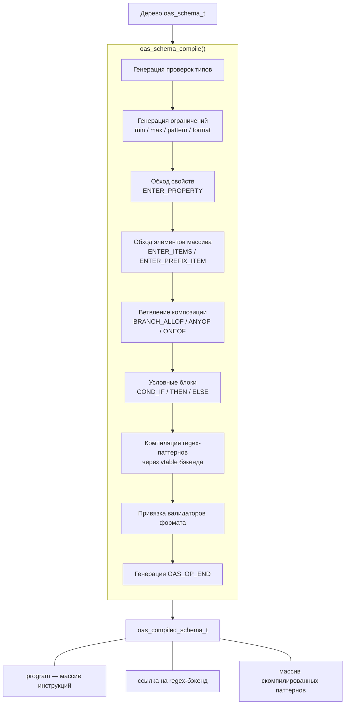

# Компилятор схем

## Обзор

Компилятор схем преобразует деревья `oas_schema_t` в плоские массивы инструкций
(`oas_program_t`), которые выполняет виртуальная машина валидации. Это устраняет
рекурсивный обход дерева при валидации, обеспечивая предсказуемое, дружественное
к кэшу выполнение.

## Конвейер компиляции



## API

### Компиляция одной схемы

```c
oas_compiler_config_t config = {
    .regex = oas_regex_libregexp_create(),
    .format_policy = OAS_FORMAT_ENFORCE,
};
oas_error_list_t *errors = oas_error_list_create(arena);

oas_compiled_schema_t *compiled = oas_schema_compile(schema, &config, errors);
if (!compiled) {
    /* Check errors for compilation failures */
}

/* Use compiled schema for validation... */

oas_compiled_schema_free(compiled);
```

### Компиляция полного документа

```c
oas_compiled_doc_t *compiled = oas_doc_compile(doc, &config, errors);
if (!compiled) {
    /* Check errors */
}

/* Compiled doc includes:
 * - Path matcher for URL routing
 * - All operation schemas compiled
 * - Parameter schemas compiled
 * - Request body / response schemas compiled
 */

oas_compiled_doc_free(compiled);
```

## Структура скомпилированной схемы

```c
struct oas_compiled_schema {
    oas_program_t program;            /* Instruction bytecode */
    oas_regex_backend_t *regex;       /* Regex backend for pattern matching */
    oas_compiled_pattern_t **patterns; /* Pre-compiled regex patterns */
    size_t pattern_count;
    size_t pattern_capacity;
};
```

## Структура скомпилированного документа

```c
struct oas_compiled_doc {
    oas_path_matcher_t *matcher;       /* Path template matcher */
    compiled_operation_t *operations;   /* Compiled operations */
    size_t operations_count;
    oas_compiled_schema_t **all_schemas; /* All schemas (for cleanup) */
    size_t all_schemas_count;
    oas_regex_backend_t *regex;         /* Shared regex backend */
    bool owns_regex;
    oas_arena_t *arena;                 /* Arena for compiled structures */
};
```

Каждый `compiled_operation_t` содержит:
- Шаблон пути и HTTP-метод
- Идентификатор операции
- Скомпилированные схемы тела запроса по типу контента
- Скомпилированные схемы ответов по коду статуса и типу контента
- Скомпилированные схемы параметров (query, header, path, cookie)

## Набор инструкций

Байткод использует формат инструкций фиксированного размера:

```c
typedef struct {
    oas_opcode_t op;       /* Operation code (uint8_t enum) */
    uint8_t type_mask;     /* Type bitmask for CHECK_TYPE */
    uint16_t _pad;
    union {
        int64_t i64;       /* Integer operands (min/max lengths, counts) */
        double f64;        /* Float operands (minimum/maximum/multipleOf) */
        const char *str;   /* String operands (property names, patterns) */
        size_t offset;     /* Jump targets */
        void *ptr;         /* Compiled pattern pointers, format functions */
        struct {
            uint16_t count;
            uint16_t index;
        } branch;          /* Composition branch metadata */
    } operand;
} oas_instruction_t;
```

### Справочник инструкций

**Проверки типа и значения:**

| Опкод | Операнд | Описание |
|-------|---------|----------|
| `CHECK_TYPE` | `type_mask` | Проверить соответствие типа значения битовой маске |
| `CHECK_ENUM` | `ptr` (yyjson_val*) | Значение должно быть в массиве enum |
| `CHECK_CONST` | `ptr` (yyjson_val*) | Значение должно совпадать с const |

**Строковые ограничения:**

| Опкод | Операнд | Описание |
|-------|---------|----------|
| `CHECK_MIN_LEN` | `i64` | Количество кодовых точек Unicode >= min |
| `CHECK_MAX_LEN` | `i64` | Количество кодовых точек Unicode <= max |
| `CHECK_PATTERN` | `ptr` (compiled regex) | Строка соответствует образцу ECMA-262 |
| `CHECK_FORMAT` | `ptr` (format function) | Строка проходит валидатор формата |

**Числовые ограничения:**

| Опкод | Операнд | Описание |
|-------|---------|----------|
| `CHECK_MINIMUM` | `f64` | value >= minimum |
| `CHECK_MAXIMUM` | `f64` | value <= maximum |
| `CHECK_EX_MINIMUM` | `f64` | value > exclusiveMinimum |
| `CHECK_EX_MAXIMUM` | `f64` | value < exclusiveMaximum |
| `CHECK_MULTIPLE_OF` | `f64` | value % multipleOf == 0 |

**Ограничения массивов:**

| Опкод | Операнд | Описание |
|-------|---------|----------|
| `CHECK_MIN_ITEMS` | `i64` | Длина массива >= min |
| `CHECK_MAX_ITEMS` | `i64` | Длина массива <= max |
| `CHECK_UNIQUE` | -- | Все элементы уникальны |
| `ENTER_ITEMS` | -- | Валидировать каждый элемент по схеме items |
| `ENTER_PREFIX_ITEM` | `i64` (index) | Валидировать элемент по индексу |
| `CHECK_CONTAINS` | -- | Хотя бы один элемент соответствует схеме contains |

**Ограничения объектов:**

| Опкод | Операнд | Описание |
|-------|---------|----------|
| `CHECK_REQUIRED` | `str` | Именованное свойство должно существовать |
| `ENTER_PROPERTY` | `str` | Войти в свойство для подвалидации |
| `ENTER_ADDITIONAL` | -- | Валидировать дополнительные свойства |
| `CHECK_MIN_PROPS` | `i64` | Количество свойств >= min |
| `CHECK_MAX_PROPS` | `i64` | Количество свойств <= max |
| `CHECK_PROP_NAMES` | -- | Все имена свойств соответствуют схеме |
| `CHECK_PATTERN_PROPS` | -- | Валидация свойств по образцу |
| `CHECK_DEP_REQUIRED` | -- | Валидация зависимых обязательных свойств |
| `CHECK_DEP_SCHEMA` | -- | Валидация зависимых схем |

**Композиция и управление потоком выполнения:**

| Опкод | Операнд | Описание |
|-------|---------|----------|
| `BRANCH_ALLOF` | `branch` | Все подсхемы должны совпасть |
| `BRANCH_ANYOF` | `branch` | Хотя бы одна должна совпасть |
| `BRANCH_ONEOF` | `branch` | Ровно одна должна совпасть |
| `NEGATE` | -- | Инвертировать (not) результат |
| `COND_IF` | -- | Вычислить if-схему |
| `COND_THEN` | -- | Применить then-схему если условие прошло |
| `COND_ELSE` | -- | Применить else-схему если условие не прошло |
| `DISCRIMINATOR` | `str` | Диспетчеризация по свойству дискриминатора |
| `JUMP` | `offset` | Безусловный переход |
| `JUMP_IF_FAIL` | `offset` | Переход при неудаче предыдущей проверки |
| `PUSH_SCOPE` | -- | Поместить область видимости в стек |
| `POP_SCOPE` | -- | Извлечь область видимости из стека |
| `CHECK_UNEVAL_PROPS` | -- | Проверить невычисленные свойства |
| `CHECK_UNEVAL_ITEMS` | -- | Проверить невычисленные элементы |
| `END` | -- | Завершение программы |

## Компиляция регулярных выражений

При компиляции каждое ключевое слово `pattern` компилируется через regex-бэкенд:

```c
oas_compiled_pattern_t *pat = nullptr;
int rc = config->regex->compile(config->regex, schema->pattern, &pat);
if (rc < 0) {
    /* Invalid regex pattern -- add compilation error */
}
/* pat is stored in the compiled schema and referenced by CHECK_PATTERN instructions */
```

Флаг `borrow_regex` в `oas_compiler_config_t` управляет владением:
- `false` (по умолчанию): скомпилированная схема принимает владение regex-бэкендом
- `true`: вызывающий сохраняет владение (полезно при разделении одного бэкенда между схемами)

## Конфигурация компилятора

```c
typedef struct {
    oas_regex_backend_t *regex;   /* Regex backend for pattern compilation */
    uint8_t format_policy;        /* OAS_FORMAT_IGNORE / WARN / ENFORCE */
    bool borrow_regex;            /* If true, caller retains regex ownership */
} oas_compiler_config_t;
```
