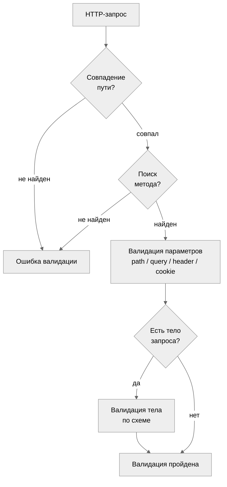
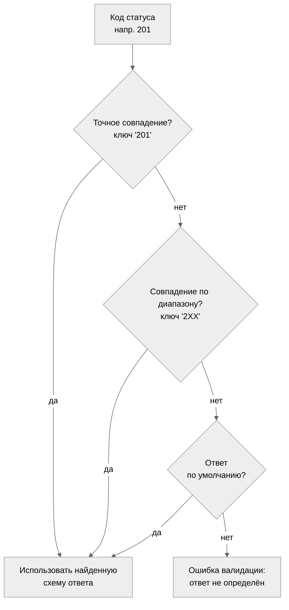

# Движок валидации

Движок валидации выполняет скомпилированный байткод схемы для проверки JSON-значений
и HTTP-сообщений. Заголовочный файл: `oas_validator.h`.

## Валидация схемы

### Валидация значения yyjson

```c
oas_validation_result_t result = {0};
int rc = oas_validate(compiled_schema, yyjson_value, &result, arena);
if (rc < 0) {
    /* invalid arguments (-EINVAL) */
}
if (!result.valid) {
    /* inspect result.errors */
}
```

`oas_validate()` принимает предварительно скомпилированную схему и `yyjson_val *`.
Функция заполняет `oas_validation_result_t` флагом `valid` и списком ошибок.

### Валидация JSON-строки

```c
oas_validation_result_t result = {0};
int rc = oas_validate_json(compiled_schema, json_str, json_len, &result, arena);
```

`oas_validate_json()` сначала разбирает JSON-строку, а затем валидирует
полученное значение. Ошибки разбора сообщаются как ошибки `OAS_ERR_PARSE`.

## Результат валидации

```c
typedef struct {
    bool valid;                /* true if all checks passed */
    oas_error_list_t *errors;  /* accumulated errors (arena-allocated) */
} oas_validation_result_t;
```

Результат считается валидным, когда `valid` равен true и список ошибок пуст.
При неуспешной валидации собираются все нарушения ограничений -- валидатор
не останавливается на первой ошибке.

## Валидация HTTP-запросов

```c
oas_http_request_t req = {
    .method       = "POST",
    .path         = "/pets",
    .content_type = "application/json",
    .body         = body_json,
    .body_len     = body_len,
    .headers      = headers,
    .headers_count = header_count,
    .query        = query_params,
    .query_count  = query_count,
};

oas_validation_result_t result = {0};
int rc = oas_validate_request(compiled_doc, &req, &result, arena);
```

Валидация запроса выполняет следующие шаги:



1. **Сопоставление пути** -- сопоставление `req.path` со всеми шаблонами путей
   в скомпилированном документе с извлечением параметров пути.
2. **Поиск метода** -- поиск операции для совпавшего пути и HTTP-метода.
3. **Валидация параметров** -- проверка параметров пути, запроса, заголовков
   и cookie на соответствие объявленным схемам.
4. **Валидация тела запроса** -- если операция объявляет тело запроса,
   валидация `req.body` по схеме для соответствующего типа содержимого.

### oas_http_request_t

| Поле           | Тип                         | Описание                       |
|----------------|-----------------------------|--------------------------------|
| `method`       | `const char *`              | HTTP-метод (`"GET"`, `"POST"`) |
| `path`         | `const char *`              | Путь запроса (например, `"/pets/123"`) |
| `content_type` | `const char *`              | Заголовок Content-Type (может быть null) |
| `body`         | `const char *`              | Тело запроса (может быть null) |
| `body_len`     | `size_t`                    | Длина тела в байтах            |
| `headers`      | `const oas_http_header_t *` | Пары имя/значение заголовков   |
| `headers_count`| `size_t`                    | Количество заголовков          |
| `query`        | `const oas_http_query_param_t *` | Пары параметров запроса   |
| `query_count`  | `size_t`                    | Количество параметров запроса  |
| `query_string` | `const char *`              | Сырая строка запроса (может быть null) |

## Валидация HTTP-ответов

```c
oas_http_response_t resp = {
    .status_code  = 200,
    .content_type = "application/json",
    .body         = response_json,
    .body_len     = response_len,
    .headers      = resp_headers,
    .headers_count = resp_header_count,
};

oas_validation_result_t result = {0};
int rc = oas_validate_response(compiled_doc, "/pets", "GET", &resp, &result, arena);
```

Для валидации ответа необходимы исходный путь запроса и метод, чтобы найти
правильную операцию и определение ответа.

### oas_http_response_t

| Поле           | Тип                         | Описание                       |
|----------------|-----------------------------|--------------------------------|
| `status_code`  | `int`                       | Код статуса HTTP (например, 200) |
| `content_type` | `const char *`              | Заголовок Content-Type (может быть null) |
| `body`         | `const char *`              | Тело ответа (может быть null)  |
| `body_len`     | `size_t`                    | Длина тела в байтах            |
| `headers`      | `const oas_http_header_t *` | Пары имя/значение заголовков   |
| `headers_count`| `size_t`                    | Количество заголовков          |

## Сопоставление путей

Валидатор сопоставляет пути запросов с шаблонами путей OpenAPI, выполняя
посегментное сравнение:

- Литеральные сегменты должны совпадать точно.
- Шаблонные сегменты (`{petId}`) совпадают с любым непустым значением.
- Параметры пути извлекаются и валидируются по своим схемам.

Пример: шаблон пути `/pets/{petId}` совпадает с `/pets/123` и извлекает
`petId = "123"`.

## Сопоставление кодов статуса

Поиск ответа следует цепочке приоритетов:



Если ни одно определение ответа не совпадает, валидация сообщает об ошибке.

## Накопление ошибок

Валидация собирает все ошибки, а не завершается при первом нарушении.
Ошибки хранятся в `oas_error_list_t` (размещены в arena).

### Структура ошибки

```c
typedef struct {
    oas_error_kind_t kind;    /* error category */
    const char *message;      /* human-readable description */
    const char *path;         /* JSON Pointer to error location */
    uint32_t line;            /* source line (parse errors) */
    uint32_t column;          /* source column (parse errors) */
} oas_error_t;
```

### Виды ошибок

| Вид                | Описание                          |
|--------------------|-----------------------------------|
| `OAS_ERR_PARSE`    | Ошибка разбора JSON/YAML          |
| `OAS_ERR_SCHEMA`   | Структурная ошибка JSON Schema    |
| `OAS_ERR_REF`      | Ошибка разрешения `$ref`          |
| `OAS_ERR_TYPE`     | Несоответствие типа               |
| `OAS_ERR_CONSTRAINT` | Нарушение min/max/pattern       |
| `OAS_ERR_REQUIRED` | Отсутствует обязательное поле     |
| `OAS_ERR_FORMAT`   | Ошибка валидации формата          |
| `OAS_ERR_ALLOC`    | Ошибка выделения памяти           |

### Пути JSON Pointer

Каждая ошибка содержит путь JSON Pointer (RFC 6901), указывающий на расположение
ошибки во входном документе. Для вложенных объектов пути выглядят как
`/address/zipCode`. Для массивов используются целочисленные индексы: `/items/2/name`.

### Итерация по ошибкам

```c
size_t count = oas_error_list_count(result.errors);
for (size_t i = 0; i < count; i++) {
    const oas_error_t *err = oas_error_list_get(result.errors, i);
    fprintf(stderr, "[%s] %s at %s\n",
            oas_error_kind_name(err->kind), err->message, err->path);
}
```

## RFC 9457 Problem Details

Ошибки валидации можно преобразовать в формат RFC 9457 Problem Details JSON
с помощью `oas_problem.h`:

```c
char *json = oas_problem_from_validation(&result, 422, &json_len);
/* send json as HTTP response body */
oas_problem_free(json);
```

Это создаёт структурированный ответ об ошибке, подходящий для возврата
клиентам API.
