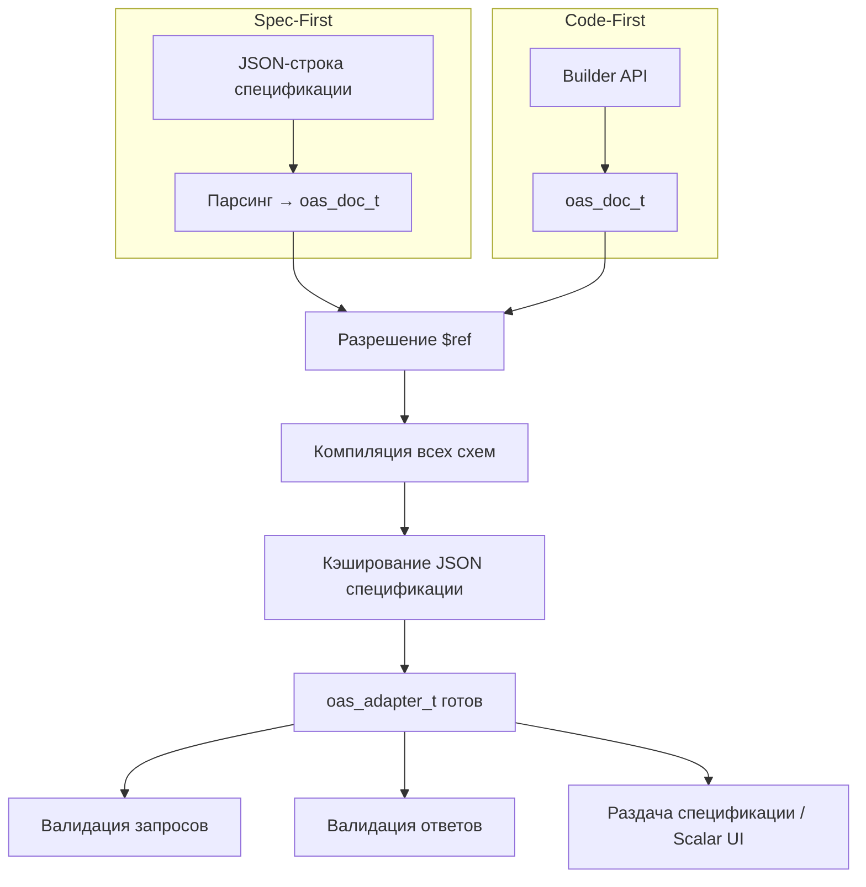

# Руководство по интеграции

API адаптера (`oas_adapter.h`) предоставляет единый фасад для интеграции
liboas с HTTP-серверами. Он объединяет парсер, компилятор, валидатор и эмиттер
в единый жизненный цикл.

## Подход Spec-First

Загрузка спецификации OpenAPI из JSON, компиляция и валидация запросов:

```c
#include <liboas/oas_adapter.h>

/* Configure the adapter */
oas_adapter_config_t config = {
    .validate_requests  = true,
    .validate_responses = false,  /* enable in development */
    .serve_spec         = true,
    .serve_scalar       = true,
    .spec_url           = "/openapi.json",
    .docs_url           = "/docs",
};

/* Create adapter from JSON spec */
oas_error_list_t *errors = oas_error_list_create(arena);
oas_adapter_t *adapter = oas_adapter_create(spec_json, spec_len, &config, errors);
if (!adapter) {
    /* handle parse/compile errors */
}

/* Use adapter for request validation, spec serving, etc. */

/* Cleanup */
oas_adapter_destroy(adapter);
```

Адаптер внутренне выполняет следующее:



1. Создаёт arena и разбирает JSON в `oas_doc_t`.
2. Разрешает все ссылки `$ref`.
3. Компилирует все схемы с regex-бэкендом по умолчанию.
4. Кэширует JSON спецификации для раздачи.

## Подход Code-First

Программное построение документа OpenAPI с помощью builder API и создание
адаптера из него:

```c
#include <liboas/oas_adapter.h>
#include <liboas/oas_builder.h>

oas_arena_t *arena = oas_arena_create(0);

/* Build the document */
oas_doc_t *doc = oas_doc_build(arena, "Pet Store", "1.0.0");
oas_doc_add_server(doc, arena, "https://api.example.com", "Production");

/* Define schemas */
oas_schema_t *pet = oas_schema_build_object(arena);
oas_schema_add_property(arena, pet, "id", oas_schema_build_int64(arena));
oas_schema_add_property(arena, pet, "name", oas_schema_build_string(arena));
oas_schema_set_required(arena, pet, "id", "name", NULL);
oas_doc_add_component_schema(doc, arena, "Pet", pet);

/* Define operations */
oas_response_builder_t responses[] = {
    {.status = 200, .description = "Pet list", .schema = oas_schema_build_array(arena, pet)},
    {.status = 0},  /* sentinel */
};

oas_op_builder_t op = {
    .summary      = "List all pets",
    .operation_id = "listPets",
    .tag          = "pets",
    .responses    = responses,
};

oas_doc_add_path_op(doc, arena, "/pets", "GET", &op);

/* Create adapter from builder-constructed document */
oas_adapter_t *adapter = oas_adapter_from_doc(doc, arena, &config, errors);
```

## Конфигурация

`oas_adapter_config_t` управляет поведением адаптера:

| Поле                 | Тип           | По умолчанию        | Описание                       |
|----------------------|---------------|---------------------|--------------------------------|
| `validate_requests`  | `bool`        | `false`             | Валидировать входящие запросы  |
| `validate_responses` | `bool`        | `false`             | Валидировать исходящие ответы  |
| `serve_spec`         | `bool`        | `false`             | Раздавать JSON спецификации по `spec_url` |
| `serve_scalar`       | `bool`        | `false`             | Раздавать Scalar UI по `docs_url` |
| `spec_url`           | `const char*` | `"/openapi.json"`   | URL-путь для раздачи спецификации |
| `docs_url`           | `const char*` | `"/docs"`           | URL-путь для Scalar UI         |

Передайте `nullptr` вместо конфигурации, чтобы использовать все значения по умолчанию
(без валидации, без раздачи).

## Раздача спецификации

Когда включён `serve_spec`, адаптер кэширует JSON-представление:

```c
size_t json_len;
const char *json = oas_adapter_spec_json(adapter, &json_len);
/* respond with Content-Type: application/json */
```

Возвращённая строка принадлежит адаптеру и валидна в течение его времени жизни.

## Scalar UI

Генерация HTML-страницы для просмотра документации Scalar API:

```c
size_t html_len;
char *html = oas_scalar_html("Pet Store API", "/openapi.json", &html_len);
/* respond with Content-Type: text/html */
free(html);  /* caller owns the string */
```

Сгенерированный HTML загружает Scalar UI из CDN и указывает на URL спецификации.

## Поиск операции

Поиск операции, соответствующей методу и пути запроса:

```c
oas_matched_operation_t match;
int rc = oas_adapter_find_operation(adapter, "GET", "/pets/123", &match, arena);
if (rc == 0) {
    printf("Matched: %s %s\n", match.method, match.path_template);
    printf("Operation ID: %s\n", match.operation_id);
    for (size_t i = 0; i < match.param_count; i++) {
        printf("  %s = %s\n", match.param_names[i], match.param_values[i]);
    }
} else if (rc == -ENOENT) {
    /* no matching operation */
}
```

`oas_matched_operation_t` содержит:

- `operation_id` -- идентификатор `operationId`, если определён (может быть null)
- `path_template` -- совпавший шаблон (например, `"/pets/{petId}"`)
- `method` -- HTTP-метод
- `param_names` / `param_values` / `param_count` -- извлечённые параметры пути

## Валидация запросов через адаптер

```c
oas_http_request_t req = {
    .method       = "POST",
    .path         = "/pets",
    .content_type = "application/json",
    .body         = body,
    .body_len     = body_len,
};

oas_validation_result_t result = {0};
oas_arena_t *req_arena = oas_arena_create(0);
int rc = oas_adapter_validate_request(adapter, &req, &result, req_arena);

if (!result.valid) {
    char *problem = oas_problem_from_validation(&result, 422, nullptr);
    /* send 422 response with problem JSON */
    oas_problem_free(problem);
}
oas_arena_destroy(req_arena);
```

Используйте отдельную arena для каждого запроса при размещении ошибок валидации.
Это сохраняет arena адаптера чистой и позволяет выполнять очистку за O(1)
после каждого запроса.

## Валидация ответов через адаптер

```c
oas_http_response_t resp = {
    .status_code  = 200,
    .content_type = "application/json",
    .body         = response_body,
    .body_len     = response_body_len,
};

oas_validation_result_t result = {0};
int rc = oas_adapter_validate_response(adapter, "/pets", "GET", &resp, &result, arena);
```

Валидация ответов обычно включается только при разработке и тестировании
для выявления расхождений со схемой ответа.

## Паттерн Middleware

Типичная интеграция в качестве HTTP middleware:

```c
int handle_request(http_request *raw_req, http_response *raw_resp) {
    /* Build oas_http_request_t from your framework's request type */
    oas_http_request_t req = convert_request(raw_req);

    /* Check for spec/docs serving */
    const oas_adapter_config_t *cfg = oas_adapter_config(adapter);
    if (cfg->serve_spec && strcmp(req.path, cfg->spec_url) == 0) {
        size_t len;
        const char *json = oas_adapter_spec_json(adapter, &len);
        return send_response(raw_resp, 200, "application/json", json, len);
    }

    /* Validate request */
    if (cfg->validate_requests) {
        oas_arena_t *req_arena = oas_arena_create(0);
        oas_validation_result_t result = {0};
        oas_adapter_validate_request(adapter, &req, &result, req_arena);
        if (!result.valid) {
            char *problem = oas_problem_from_validation(&result, 422, nullptr);
            int rc = send_response(raw_resp, 422, "application/problem+json",
                                   problem, strlen(problem));
            oas_problem_free(problem);
            oas_arena_destroy(req_arena);
            return rc;
        }
        oas_arena_destroy(req_arena);
    }

    /* Dispatch to handler ... */
    return dispatch(raw_req, raw_resp);
}
```

## Доступ к документу

Получение разобранного документа из адаптера для анализа:

```c
const oas_doc_t *doc = oas_adapter_doc(adapter);
printf("API: %s v%s\n", doc->info->title, doc->info->version);
```

## Согласование типа содержимого

Заголовочный файл `oas_negotiate.h` предоставляет согласование типа содержимого:

```c
const char *available[] = {"application/json", "application/xml"};
const char *best = oas_negotiate_content_type(accept_header, available, 2);
```

Возвращает наиболее подходящий медиатип из заголовка `Accept` или `nullptr`,
если подходящий тип недоступен.
